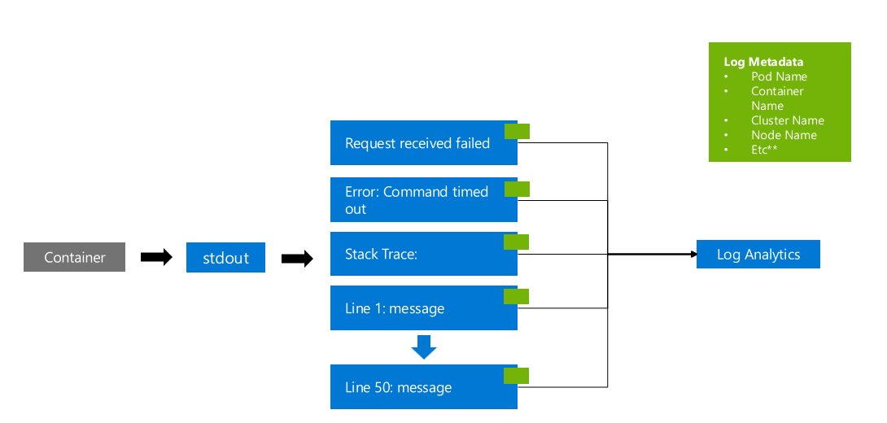

# AKS Logging Optimisations

## Overview

Bundling up content to help customers optimisating logging for workloads running on Azure Kubernetes Service.

## Data Collection Rule

Log Analytics Workspace support on-ingestion transformation for certain tables. Luckily the `ContainerLog` and `ContainerLogv2` tables are both supported. This means you can reduce the logging cost of your AKS clusters by filtering out unneeded logs. This is also great for dropping any logs with Personal Identifiable Information before it's ingested.

### Guide

Investigate the logs being generated by pods in your cluster and create a list of messages that you'd like to exclude from ingestion.

Some suggestions are:

- `kube-probe`: As every pod will have a readiness and liveness health check setup, usually every 10seconds or so. Log messages generated by these checks can be noisy.
- `/health`: Similar to the above `kube-probe` comment, if the pod logs out it's health check path or a success message.

By removing even just the above 2 examples you `might` be able to dramatically reduce your log ingestion passively. It all depends on what your workloads are logging.

A Data Collection Rule to exclude the above would look like:

`source | where LogMessage !has "health"| where LogMessage !has "kube-probe"`

This repository contains Bicep modules to deploy the above DCR filters on a Log Analytics workspace. Update the parameters in the `dcr.bicepparam` file. The code provided is an `example`, use at your own desecration as it's only provided as a quick start.

However to make the most of the DCR, review your Pod Logs and identify any noisy / unhelpful log messages. Ideally applications should only log useful information. To quick start reviewing your pod logs import my [AKS Workbook](https://github.com/ms-sambell/aks-workbook) and navigate to the logs table.

> **Note:** Always test the query you're adding to the DRC before implementing it. Adding a `has` KQL query may exclude more logs than intended.

> **Note:** DCRs take 30 minutes to take affect after the initial creation.

> **Note:** There may already be a DCR on your cluster for various reasons.

### Documentation

- [Portal Guide](https://learn.microsoft.com/en-us/azure/azure-monitor/logs/tutorial-workspace-transformations-portal)
- [IAC Guide](https://learn.microsoft.com/en-us/azure/azure-monitor/logs/tutorial-workspace-transformations-api)
- [Supported Tables](https://learn.microsoft.com/en-us/azure/azure-monitor/logs/tables-feature-support)
- [Transofmration Rules](https://learn.microsoft.com/en-us/azure/azure-monitor/essentials/data-collection-transformations-structure)

## Azure Diagnostic Logs

The `azureDiagnostics.json` file contains an Azure Workbook which audits Azure Diagnostic settings that are ingested into Log Analytics Workspaces. It visualises the data and provides data driven insights into your environment.

For AKS in particular it displays whether the `kube-audit` and `kube-admin-audit` logs are both being captured for a cluster. The `kube-audit-admin` log is a subnet of `kube-audit`. Customers should enable one or the other, not both.

## Container Insights

### Workload Logs

When a container writes a message to `stdout` or `stderr` it will be picked up and captured by ContainerInsights (by default, when enabled on a cluster).

This can cause multiline log messages to be ingested as separate log messages, a crude example of this is (to visualize the issue):

The above example shows a container logging a non-stringified payload to STDOUT. The payload contains a stacktrace (error dump). It causes the log message to be split into multiple lines. This:

1. Increases the cost as each row has metadata.
1. Makes it challenging to troubleshoot as the data isn't grouped correctly.

This log message should instead be written to STDOUT or STDERR as a `stringified JSON` object. ContainerInsights will pickup and store the log like:

> **Note:** The above is just an example of a structured log message. For guidance on application logging review the following [guide](https://learn.microsoft.com/en-us/dotnet/core/extensions/logging?tabs=command-line).

### ContainerLogV2

There's some new features that have been released for ContainerInsights that are aimed at reducing the logging costs. These benefits are available when you upgrade to the new [ContainerLogV2](https://learn.microsoft.com/en-us/azure/azure-monitor/containers/container-insights-logging-v2) format. A few useful features are:

- Multiline Log Parsing
- Reducing Ingestion Frequency
- Basic logs

### Configuration Options

For more information review the [cost optimisation](https://learn.microsoft.com/en-us/azure/azure-monitor/containers/container-insights-cost-config?tabs=create-CLI) document.

But `always` look at the Container Insights collection [configmap](https://learn.microsoft.com/en-us/azure/azure-monitor/containers/container-insights-agent-config) and disable settings you don't need.

- An example could be that you've deployed Prometheus into your AKS cluster and you've still got AMA scrapping pods with Prometheus Annotations.
